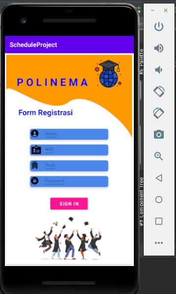
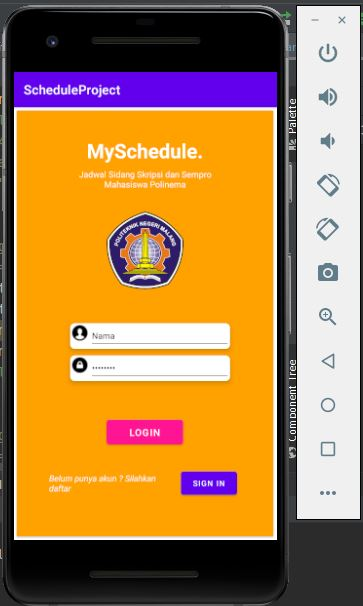
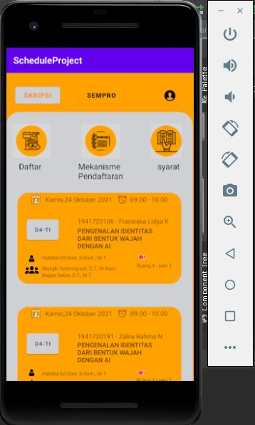
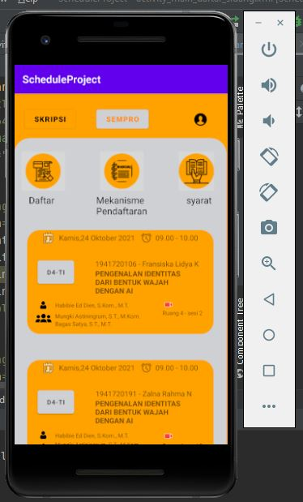
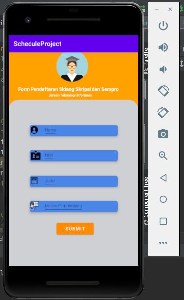
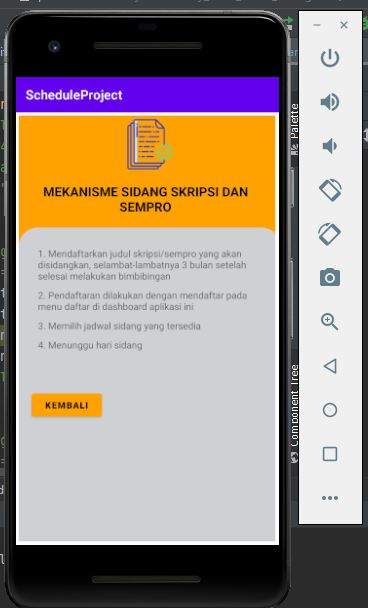
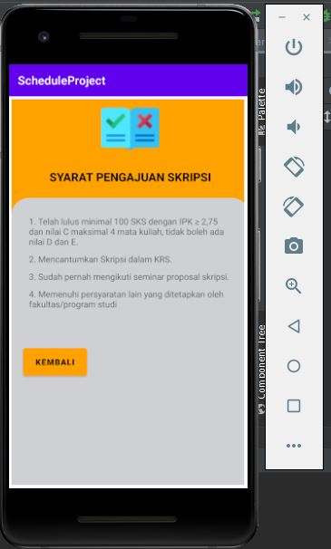
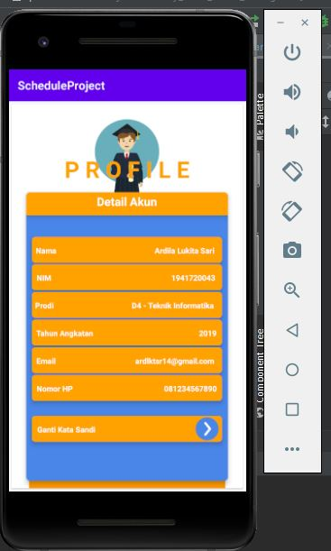
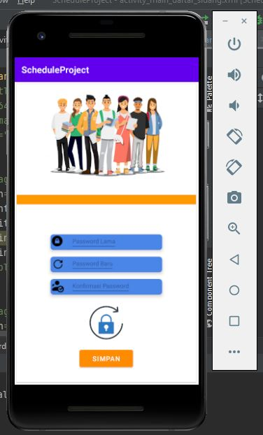

# Laporan Mini Project Pemrograman Berbasis Mobile #

**Membuat Project Jadwal Sidang Sempro dan Skripsi**
1. Klik bagian “Start A New Android Studio Project” Kemudian pilih “Empty Activity” dan klik “Next” :
2. Buat nama project sesuai keinginan, kemudian gunakan Bahasa pemrograman Java dengan Minimum API Level 19: KitKat 4.4 dan centang bagian This Project will support instant apps dan Finish.
3. Biarkan proses Sync mengunduh file-file yang diperlukan sampai dengan selesai
4. Jika proses telah selesai ganti baris kedua dengan nama <LinearLayout dan diakhiri dengan </LinearLayout
5. Pada bagian Android 🡪 app 🡪 res 🡪 drawable, simpan foto yang akan dijadikan sebagai ImageView dengan cara copy foto kemudian klik kanan bagian drawable dan klik paste kemudian tinggal next sampai selesai.
6. Kemudian membuat project seperti pada contoh sebelumnya untuk source code nya bisa dilihat lebih jelasnya lagi di github [link github](https://github.com/fransiskalidya/jadwal-mobile.git)
7. Hasil Apliakasi Jadwal Sidang Sempro dan Skripsi:

* Fitur Register

Pada fitur register mahasiswa mengisi form terlebih dahulu yaitu ada for nama, nim, prodi, dan password setelah itu kita bisa masuk dan mengetahui jadwal skripsi dan sempro

* Fitur Login

Terdapat fitur login dan SignUp yang dimana mahasiswa mendaftar terlebih dahulu jika sebelumnya sudah mempunyai akun bisa langsung masuk melalui Login mengisi username dan password mahasiswa.

* Fitur Dashboard 

Fitur dashboard aplikasi mempunyai 2 yaitu dashboard sempro dan dashboard skripsi :

Dashboard Skripsi

Pada dashboard skripsi tersebut terdapat fitur Daftar, Mekanisme Pendaftaran dan syarat. Mahasiswa bisa melihat jadwal skripsi di dashboard skripsi.

Dashboard Sempro

Pada dashboard sempro tersebut terdapat fitur Daftar, Mekanisme Pendaftaran dan syarat sama seperti pada fitur dashboard skripsi. Mahasiswa bisa melihat jadwal sempro di dashboard sempro.

* Fitur Daftar Sidang, Mekanisme Pendaftaran dan Syarat 

Daftar Sidang

Fitur daftar tersebut jadi satu dengan pendaftaran sidang skripsi dan sempro yang dimana mahasiswa mengisi form nama, nim, judul dan dosen pembimbing untuk mendaftar skripsi dan sempro.

Mekanisme Pendaftaran

Fitur pada mekanisme pendaftaran tersebut mahasiswa bisa melihat alur pendaftaran skripsi dan sempro.

Syarat Skripsi dan Sempro

Fitur syarat pengajuan skripsi diatas mahasiswa dapat mengetahui syarat apa saja untuk mengajukan skripsi tersebut agar diterima oleh dosen pembimbing.

* Fitur Profile 

Fitur profile tersebut mahasiswa bisa mengetahui data akun mahasiswa tersebut yang terdapat pada nama, nim, prodi, tahun angkatan, email, dan nomor hp. Jika kita ingin mengubah kata sandi bisa klik button ganti kata sandi dibawah tersebut. 

* Fitur Ubah Kata Sandi

Fitur ubah kata sandi diatas kita mengisi password lama terlebih dahulu kemudian mengisi password baru selanjutnya mengkonfirmasi password tersebut lalu simpan. Password akan berubah sesuai mahasiswa inginkan. 
